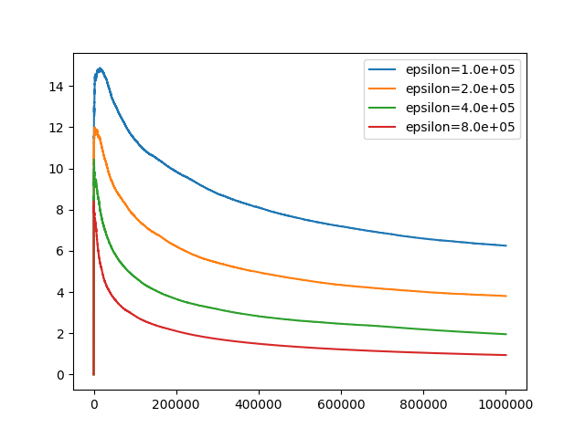

# Contents

- [LDP LinUCB Description](#ldp-linucb-description)
- [Model Architecture](#model-architecture)
- [Dataset](#dataset)
- [Environment Requirements](#environment-requirements)
- [Script Description](#script-description)
    - [Script and Sample Code](#script-and-sample-code)
    - [Script Parameters](#script-parameters)
    - [Launch](#launch)
- [Model Description](#model-description)
    - [Performance](#performance)
- [Description of Random Situation](#description-of-random-situation)
- [ModelZoo Homepage](#modelzoo-homepage)

# [LDP LinUCB](#contents)

Locally Differentially Private (LDP) LinUCB is a variant of LinUCB bandit algorithm with local differential privacy guarantee, which can preserve users' personal data with theoretical guarantee.

[Paper](https://arxiv.org/abs/2006.00701):  Kai Zheng, Tianle Cai, Weiran Huang, Zhenguo Li, Liwei Wang. "Locally Differentially Private (Contextual) Bandits Learning." *Advances in Neural Information Processing Systems*. 2020.

# [Model Architecture](#contents)

The server interacts with users in rounds. For a coming user, the server first transfers the current model parameters to the user. In the user side, the model chooses an action based on the user feature to play (e.g., choose a movie to recommend), and observes a reward (or loss) value from the user (e.g., rating of the movie). Then we perturb the data to be transferred by adding Gaussian noise. Finally, the server receives the perturbed data and updates the model. Details can be found in the [original paper](https://arxiv.org/abs/2006.00701).

# [Dataset](#contents)

Note that you can run the scripts based on the dataset mentioned in original paper. In the following sections, we will introduce how to run the scripts using the related dataset below.

Dataset used: [MovieLens 100K](https://grouplens.org/datasets/movielens/100k/)

- Dataset size：5MB, 100,000 ratings (1-5) from 943 users on 1682 movies.
- Data format：csv/txt files

# [Environment Requirements](#contents)

- Hardware (Ascend/GPU)
    - Prepare hardware environment with Ascend or GPU processor.
- Framework
    - [MindSpore](https://www.mindspore.cn/install/en)
- For more information, please check the resources below：
    - [MindSpore Tutorials](https://www.mindspore.cn/tutorials/en/master/index.html)
  - [MindSpore Python API](https://www.mindspore.cn/docs/api/en/master/index.html)

# [Script Description](#contents)

## [Script and Sample Code](#contents)

```console
├── model_zoo
    ├── README.md                                // descriptions about all the models
    ├── research
        ├── rl
            ├── ldp_linucb
                ├── README.md                    // descriptions about LDP LinUCB
                ├── scripts
                │   ├── run_train_eval.sh        // shell script for running on Ascend
                ├── src
                │   ├── dataset.py               // dataset for movielens
                │   ├── linucb.py                // model
                ├── train_eval.py                // training script
                ├── result1.png                  // experimental result
                ├── result2.png                  // experimental result
```

## [Script Parameters](#contents)

- Parameters for preparing MovieLens 100K dataset

  ```python
  'num_actions': 20         # number of candidate movies to be recommended
  'rank_k': 20              # rank of rating matrix completion
  ```

- Parameters for LDP LinUCB, MovieLens 100K dataset

  ```python
  'epsilon': 8e5            # privacy parameter
  'delta': 0.1              # privacy parameter
  'alpha': 0.1              # failure probability
  'iter_num': 1e6           # number of iterations
  ```

## [Launch](#contents)

- running on Ascend

  ```shell
  python train_eval.py > result.log 2>&1 &
  ```

The python command above will run in the background, you can view the results through the file `result.log`.

The regret value will be achieved as follows:

```console
--> Step: 0, diff: 348.662, current_regret: 0.000, cumulative regret: 0.000
--> Step: 1, diff: 338.457, current_regret: 0.000, cumulative regret: 0.000
--> Step: 2, diff: 336.465, current_regret: 2.000, cumulative regret: 2.000
--> Step: 3, diff: 327.337, current_regret: 0.000, cumulative regret: 2.000
--> Step: 4, diff: 325.039, current_regret: 2.000, cumulative regret: 4.000
...
```

# [Model Description](#contents)

The [original paper](https://arxiv.org/abs/2006.00701) assumes that the norm of user features is bounded by 1 and the norm of rating scores is bounded by 2. For the MovieLens dataset, we normalize rating scores to [-1,1]. Thus, we set `sigma` in Algorithm 5 to be $$4/epsilon \* sqrt(2 \* ln(1.25/delta))$$.

## [Performance](#contents)

The performance for different privacy parameters:

- x: number of iterations
- y: cumulative regret


The performance compared with optimal non-private regret O(sqrt(T)):

- x: number of iterations
- y: cumulative regret divided by sqrt(T)



# [Description of Random Situation](#contents)

In `train_eval.py`, we randomly sample a user at each round. We also add Gaussian noise to the date being transferred.

# [ModelZoo Homepage](#contents)

Please check the official
[homepage](https://gitee.com/mindspore/models).
