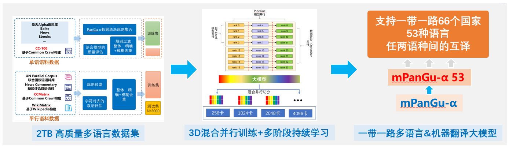
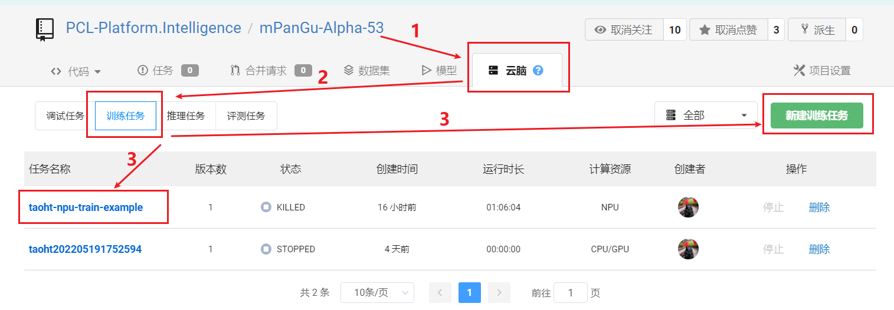
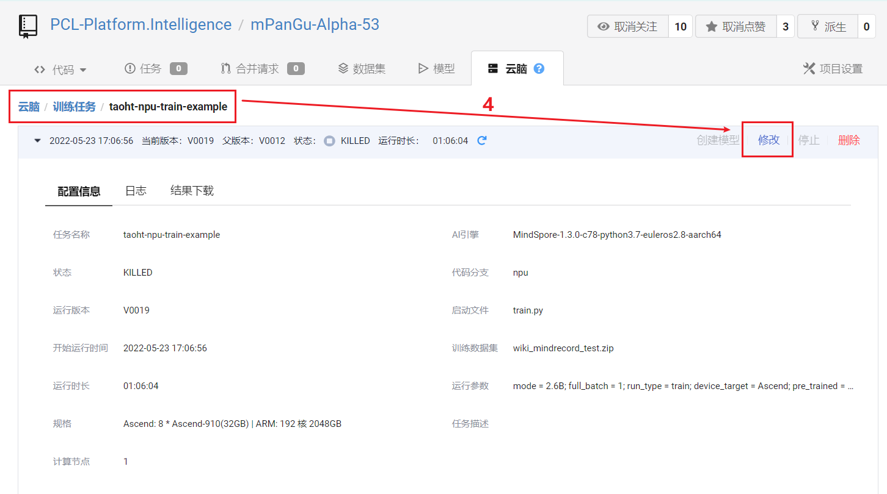
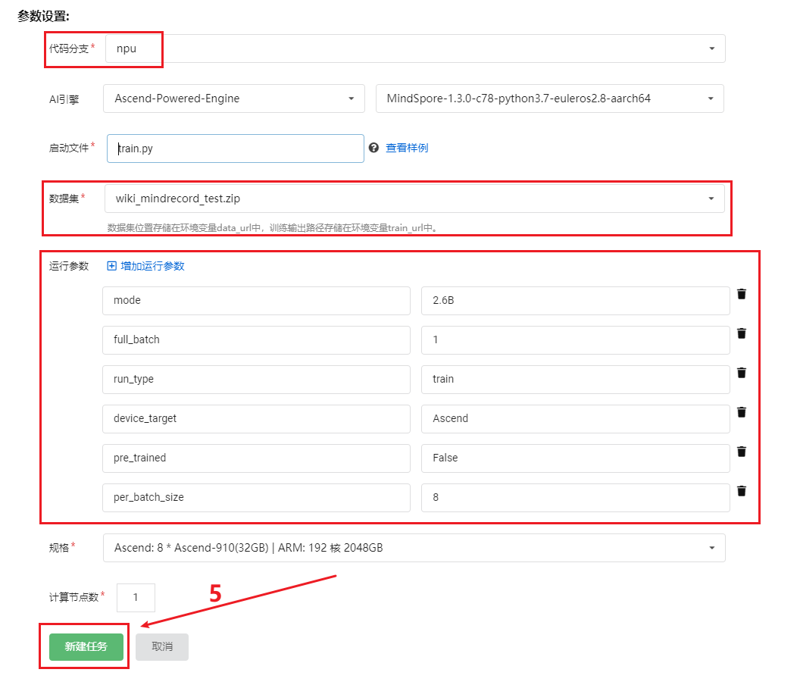
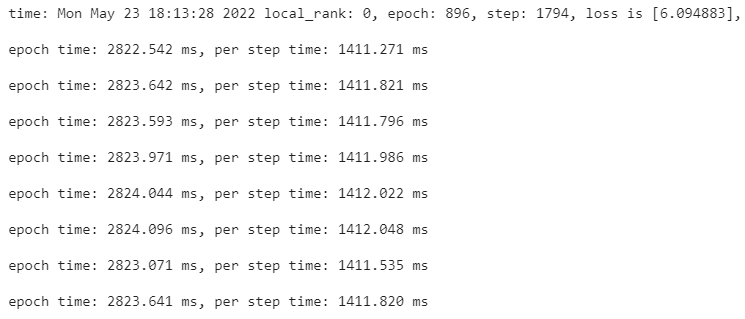

<!-- TOC -->
- [运行环境](#环境要求)
- [NPU推理](#推理)
- [NPU训练](#训练)
- [快速入门（1分钟在OpenI协作平台实现训练）](#快速入门)
- [交流通道](#交流通道)
- [许可证](#许可证)
<!-- /TOC -->

# mPanGu-Alpha-53
### 实现流程
<br/>

## 环境要求
```bash
MindSpore 1.3
```
基于“鹏城云脑2”+ModelArts，运行在C76版本环境（同OpenI启智协作平台NPU训练任务环境）

## 推理

ModelArts启动任务，启动文件predict.py
```bash
运行参数配置：
    device_num=1
    op_level_model_parallel_num=1
    run_type=predict
资源选择：
Ascend: 1 * Ascend-910(32GB) | ARM: 24 核 256GB
```

## 训练

ModelArts启动任务（以8卡为例），启动文件train.py
```bash
模型相关配置位于./src/utils.py和./src/pangu_alpha_config.py
运行参数配置：
    data_url=数据集目录
    device_num=8
    op_level_model_parallel_num=1（1或8都可以）
    per_batch_size=8
    mode=2.6B (指模型大小350M/2.6B/13B/200B...)
    full_batch=1
    run_type=train
资源选择：
Ascend: 8 * Ascend-910(32GB) | ARM: 192 核 2048GB
```
## 快速入门
### [1分钟在OpenI AI协作平台实现训练](https://git.openi.org.cn/PCL-Platform.Intelligence/mPanGu-Alpha-53/modelarts/train-job/42568/create_version?version_name=V0019)
- 参考本项目（使用npu分支）->[云脑（标题栏）](https://git.openi.org.cn/PCL-Platform.Intelligence/mPanGu-Alpha-53/debugjob?debugListType=all) ->[训练任务](https://git.openi.org.cn/PCL-Platform.Intelligence/mPanGu-Alpha-53/modelarts/train-job) ->[taoht-npu-train-example](https://git.openi.org.cn/PCL-Platform.Intelligence/mPanGu-Alpha-53/modelarts/train-job/42568) ->[修改](https://git.openi.org.cn/PCL-Platform.Intelligence/mPanGu-Alpha-53/modelarts/train-job/42568/create_version?version_name=V0019) ->新建任务

<br/>
<br/>
<br/>

<br/>


### 交流通道

- 提问：https://git.openi.org.cn/PCL-Platform.Intelligence/mPanGu-Alpha-53/issues
- 邮箱：taoht@pcl.ac.cn
- 微信群： 添加微信(备注交流群)加入技术交流群
<br/>

### 项目信息

鹏城实验室-智能部-开源所-基础技术研究室

### 许可证

[Apache License 2.0](https://git.openi.org.cn/PCL-Platform.Intelligence/mPanGu-Alpha-53)

