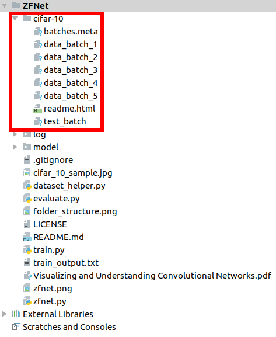

In the name of God

# ZFNet
This repository contains implementation of [ZFNet](https://arxiv.org/abs/1311.2901) (Visualizing and Understanding
Convolutional Networks) by Tensorflow and the network tested with the [CIFAR-10 dataset](https://www.cs.toronto.edu/~kriz/cifar.html).


# Download the CIFAR-10 dataset
Before train and evaluate the network, you should download the following dataset:

* CIFAR-10 Dataset: https://www.cs.toronto.edu/~kriz/cifar-10-python.tar.gz

Extract the `cifar-10-python.tar.gz` file, then your folder structure should be like the following image:



# Training CIFAR-10 dataset
To train the network with cifar-10 dataset, type the following command at the command prompt:
```
python3 ./train.py
```

Sample images from cifar-10 dataset:


## Results

### Epoch 0
```
Train Accuracy = 0.100
Test Accuracy = 0.100
```

### Epoch 1
```
Train Accuracy = 0.215
Test Accuracy = 0.216
```

### Epoch 2
```
Train Accuracy = 0.364
Test Accuracy = 0.357
```

...

### Epoch 50
```
Train Accuracy = 0.994
Test Accuracy = 0.728
```

...

### Epoch 100
```
Final Train Accuracy = 1.000
Final Test Accuracy = 0.753
```

# Evaluating CIFAR-10 dataset
To evaluate the network with cifar-10 dataset, type the following command at the command prompt:
```
python3 ./evaluate.py
```
# Dependencies
* Python 3
* numpy
* scipy
* pillow
* tensorflow

# Links
* https://arxiv.org/abs/1311.2901
* https://www.cs.toronto.edu/~kriz/cifar.html
* https://github.com/amir-saniyan/ZFNet
